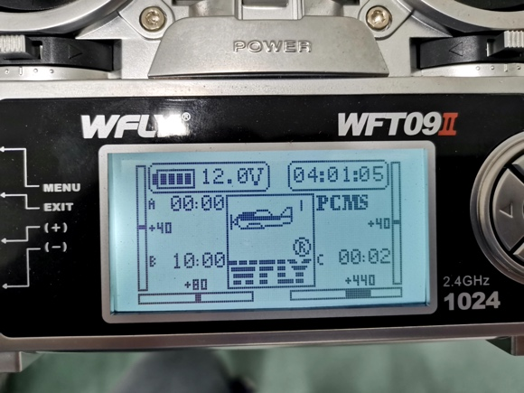
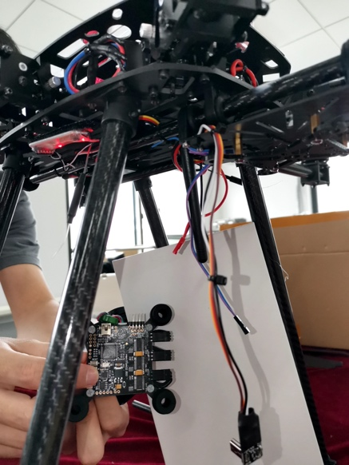
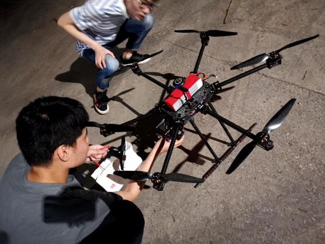
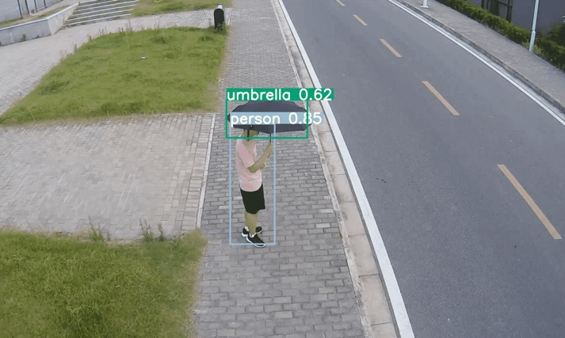
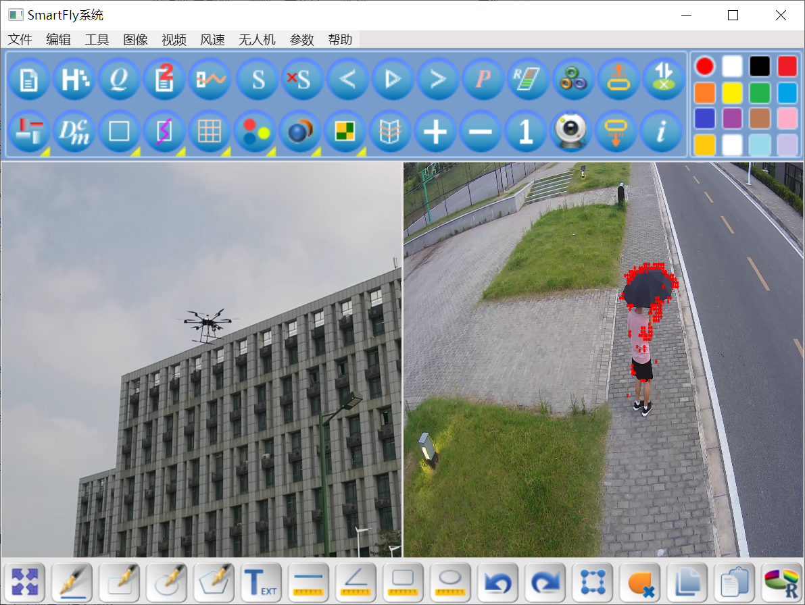
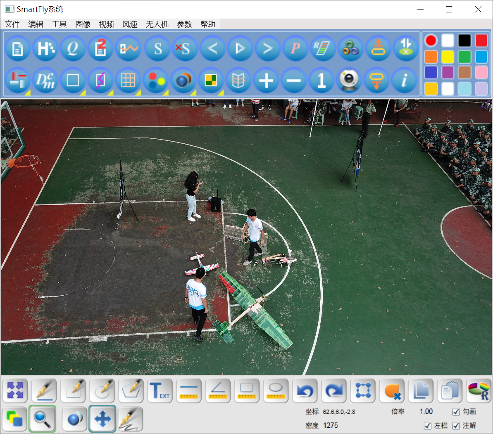
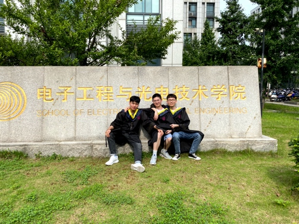
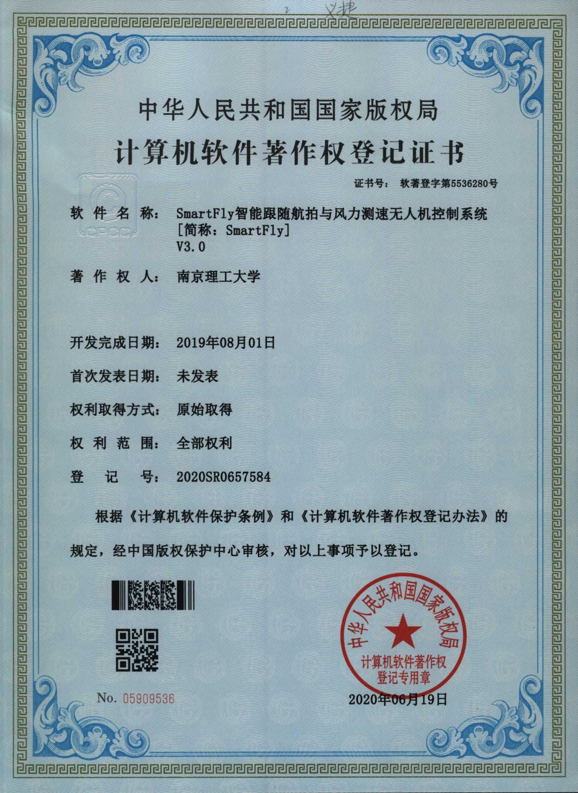

# SmartFly Intelligent Following Aerial Photography and Wind Speed Measurement of Flight Control System

SmartFly Intelligent Following Aerial Photography and Wind Speed Measurement of Flight Control System

Author: [Luis Li](https://www.l1997i.com)

E-mail: [9161040G0320@njust.edu.cn](mailto:9161040G0320@njust.edu.cn)

Institution: [Nanjing University of Science and Technology](https://www.njust.edu.cn)

## Abstract

The system is used to assist ground stations to control civilian UAVs/drones, mainly to realize the intelligent following aerial photography and wind speed measurement functions of small UAVs. Appropriate UAVs should be composed of various types of flight controllers, power modules (voltage and current detection, low-voltage homecoming), and communication modules with high-frequency radio, Bluetooth, Wi- Fi, and GPS. The ground station assistance software we designed has various functions such as intelligence following, aerial photography, wind speed measurement, obstacle avoidance, self-stabilization, hovering, home returning, out-of-control protection, remote controlling by mobile phone apps and computer software, etc. It is mainly used for outdoor activities by following characters and pedestrians in motion dynamically and has a lot of functions such as taking photos, recording videos and the movement of the characters. At the same time, the system can also measure current wind speed and notify users of wind conditions remotely. It has a wide application in outdoor activities, such as the live broadcast of all kinds of matches, large outdoor ceremonies, etc.

**Note that the user manual and report are written in Chinese and I translate the main idea and corresponding results as follows**:

## Step 1: Theoretical Studies and Literature Review

 

    
    <h5 id="title" align="center">Figure 1 WFLY: the wireless remote control panel we chosen. We borrowed and searched lots of books, papers, video, etc. on drones. We learnt how to assemble a drone, how to fly a drone with the wireless remote-control panel, how to communicate between the drone and the ground station (with 2.4GHz radio and Wi-Fi).</h5>
 

## Step 2: The Assembly and Hardware Debugging of the Drone

 

    
    <h5 id="title" align="center">Figure 2 We bought all the electronic components we need and assembled a six-axis drone by ourselves.</h5>
 

## Step 3: Test Flights

 

    
    <h5 id="title" align="center">Our research group members are working on testing flight in the evening.</h5>
 

## Step 4: Software and the Algorithms of Pedestrian Detection

 

    
    <h5 id="title" align="center">Figure 4 In order to ensure the safety, the flight of large drones must comply with various regulations in China. We applied to our school for a dedicated venue for test flights. All the videos were filmed in the school. We use a YOLO  v3 Convolutional Neural Networks to detect pedestrians.</h5>
 

 

    
    
    <h5 id="title" align="center">Figure 5 The software is written by C#, the integrated development environment (IDE) is Visual Studio 2018. All the icons are designed by myself using Photoshop and IconWorkshop. Left: Software GUI: multi-view display mode. Right: Software GUI: single-view display mode</h5>
 

 

    
    <h5 id="title" align="center">We have a strong team spirit. Without the joint efforts of ourselves, we cannot complete such a large-scale project independently. From left to right, Hongtao Ge, Luis Li and Feng Chang.</h5>
 

 

    
    <h5 id="title" align="center">The Software Copyright Registration Certificate</h5>
 

The demo video can be found in:

- [Detection & Automatic Following](video/detectionAndFollowing_0408.mov)
- [Test Flight](video/testFight_0408.mov)